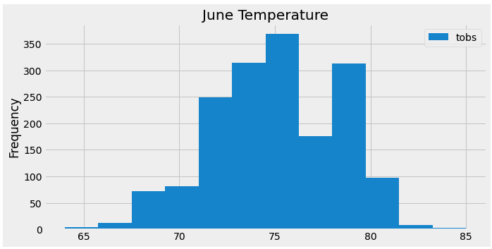
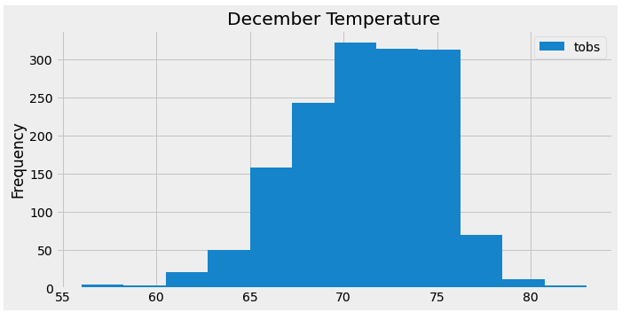
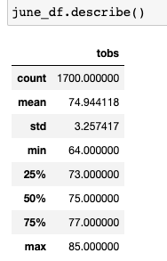
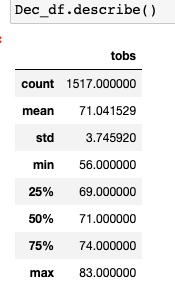
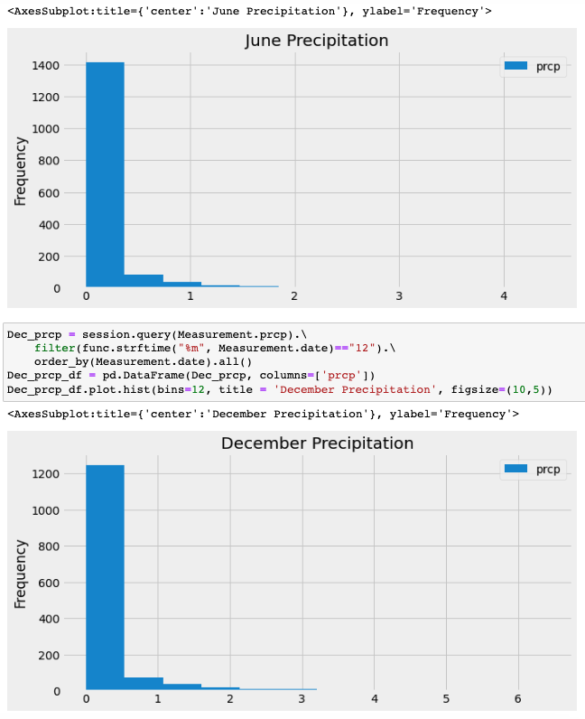

# Surfing & Shake in Hawaii

## Overview of the analysis:
- Hawaii is an attractive place for me. I want to be able to live there, enjoying surfing every day and hopefully making a living as well. Therefore, I got the idea of opening a surfing shake shop in Hawaii to serve surfboards and ice-creams to locals, tourists, and myself. Although I have some savings, I need investors backing to get this off the ground. So, I reached out to the famous investor W. Ay, who is also well-known for his level of surfing, about my strong business plan.

In this project, I will use python, panda, SQL, and other tools to analyze the weather in Hawaii, mainly focusing on the temperature and precipitation of several years' data. The report generated will release W Ay's concern about the success of the surfing shop. Because the weather in Hawaii is very suitable for surfing activities and our weather should not be a concern for us.

## Results:
- We analyzed the temperature data from 2010 to 2017, and we picked two months for illustration, June, and December.
- The temperatures of June were obviously higher than those of December. However, the differences were minimal.
- From the screenshots below, we can see that the range of June temp was between 64 to 85, and the range of December Temp was between 56 and 83.

- Although the December minimum temp was 8 degrees lower, the mean and median temp between June and December was only 4 degrees different.

## Summary:
- In general, the temperature of Hawaii should not be a concern for the success of surfing & Shake shop.
- For further research and analysis, I will first check the precipitation in June and December in Hawaii. The screenshot below shows that it rarely rained in Hawaii from 2010 to 2017, either in June or December. Therefore, we can confidently tell W. Ay that the ice cream shop in Hawaii should not be rained out or influenced by the weather.

